# Linear Regression
Performing **regression** of several degrees on the following data points, which were affected by **white** and **Poisson noise**. Additionally, studying its **MSE loss** and **bias-variance trade-off**.

$X = np.arange(-10,10,0.2)$

$Y = 2cos(X)/-\pi+(2x)/(2\pi)+2\times cos(3x)/(-3\pi)$

## Y + White Noise
White noise with an impact factor of 0.1 is added to Y.
```ruby
y_whitenoise=y+0.1*np.random.normal(size=len(y))
```
Below are the regression results for multiple degrees, along with the degrees that performed the best and worst based on MSE evaluation.
| Regression | Best Degree | Worst Degree |
| --- | --- | --- |
| 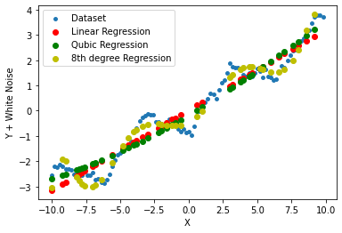 | 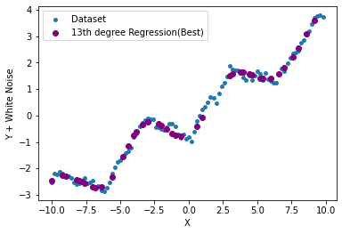 | 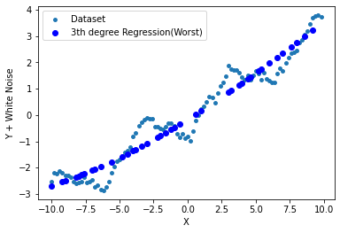 |
### Evaluation
Below are the evaluation metrics, including the **MSE loss function** and the **bias-variance trade-off**.
| MSE Loss | Bias | Variance |
| --- | --- | --- |
| 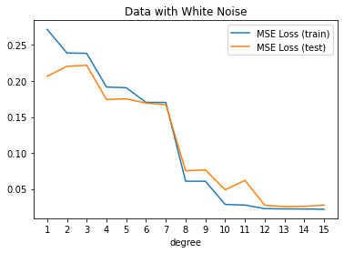 | 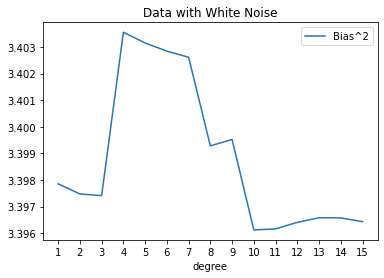 | 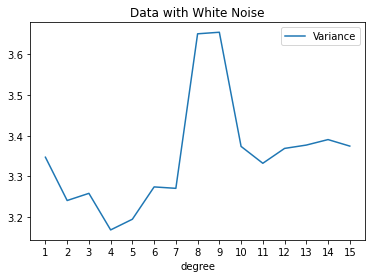 |

Here are the values of the **MSE loss function** for all degrees.

| Sample Set | Degree = 1 | Degree = 2 | Degree = 3 | Degree = 4 | Degree = 5 | Degree = 6 | Degree = 7 | Degree = 8 | Degree = 9 | Degree = 10 | Degree = 11 | Degree = 12 | Degree = 13 | Degree = 14 | Degree = 15 |
| --- | --- | --- | --- | --- | --- | --- | --- | --- | --- | --- | --- | --- | --- | --- | --- |
| Train Set | 0.207 | 0.220 | 0.222 | 0.174 | 0.175 | 0.169 | 0.167 | 0.075 | 0.076 | 0.049 | 0.062 | 0.027 | 0.026 | 0.026 | 0.028 |
| Test Set | 0.272 | 0.239 | 0.238 | 0.192 | 0.191 | 0.170 | 0.170 | 0.061 | 0.061 | 0.029 | 0.028 | 0.023 | 0.022 | 0.022 | 0.022 |

## Y + Poisson Noise
Poisson noise with an impact factor of 0.1 is added to Y.
```ruby
y_poissonnoise=y+0.1*np.random.poisson(lam=2,size=100)
```
Below are the regression results for multiple degrees, along with the degrees that performed the best and worst based on MSE evaluation.
| Regression | Best Degree | Worst Degree |
| --- | --- | --- |
| 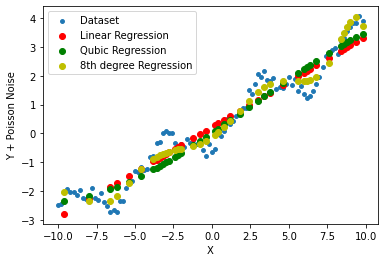 | 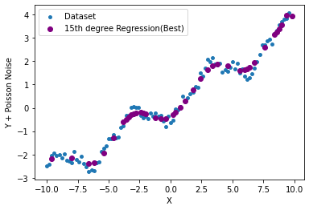 | 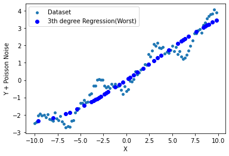 |
### Evaluation
Below are the evaluation metrics, including the **MSE loss function** and the **bias-variance trade-off**.
| MSE Loss | Bias | Variance |
| --- | --- | --- |
| 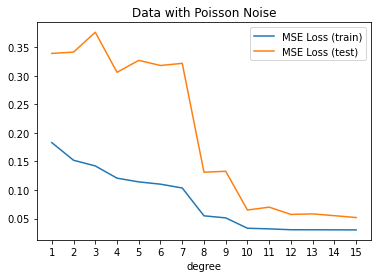 | 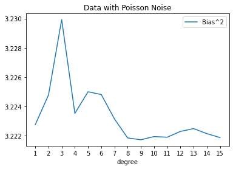 | 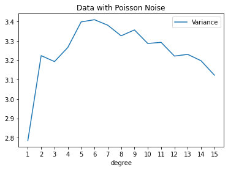 |

Here are the values of the **MSE loss function** for all degrees.

| Sample Set | Degree = 1 | Degree = 2 | Degree = 3 | Degree = 4 | Degree = 5 | Degree = 6 | Degree = 7 | Degree = 8 | Degree = 9 | Degree = 10 | Degree = 11 | Degree = 12 | Degree = 13 | Degree = 14 | Degree = 15 |
| --- | --- | --- | --- | --- | --- | --- | --- | --- | --- | --- | --- | --- | --- | --- | --- |
| Train Set | 0.339 | 0.342 | 0.376 | 0.306 | 0.327 | 0.318 | 0.322 | 0.131 | 0.133 | 0.065 | 0.070 | 0.057 | 0.058 | 0.55 | 0.052 |
| Test Set | 0.183 | 0.152 | 0.142 | 0.121 | 0.114 | 0.110 | 0.103 | 0.055 | 0.051 | 0.033 | 0.032 | 0.030 | 0.030 | 0.030 | 0.030 |

## Course Description
- **Course**: Machine Learning [ECE 501]
- **Semester**: Spring 2023
- **Institution:** [School of Electrical & Computer Engineering](https://ece.ut.ac.ir/en/), [College of Engineering](https://eng.ut.ac.ir/en), [University of Tehran](https://ut.ac.ir/en)
- **Instructors:** Dr. A. Dehaqani, Dr. Tavassolipour